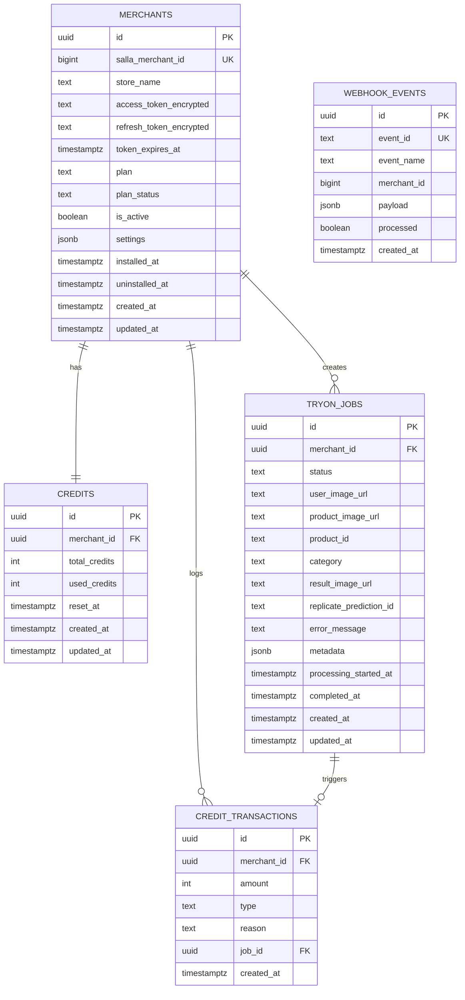

# ERD - Virtual Try-On
# Entity Relationship Diagram (ERD)
# Virtual Try-On — Database Schema

**Database:** Supabase (PostgreSQL 15+)
**ORM:** None (direct Supabase JS client)
**Security:** Row Level Security enabled on all tables

---

## Entity Overview

```
┌─────────────────────────────────────────────────────────────────┐
│                        SYSTEM ENTITIES                          │
├─────────────────────────────────────────────────────────────────┤
│                                                                 │
│  MERCHANTS ──────────┬──── 1:1 ────── CREDITS                  │
│  (source of truth)   │                (balance)                 │
│                      │                                          │
│                      ├──── 1:N ────── TRYON_JOBS                │
│                      │                (AI processing)           │
│                      │                                          │
│                      └──── 1:N ────── CREDIT_TRANSACTIONS       │
│                                       (audit trail)             │
│                                                                 │
│  TRYON_JOBS ──────────────── 1:N ──── CREDIT_TRANSACTIONS       │
│                                       (job-triggered)           │
│                                                                 │
│  WEBHOOK_EVENTS (standalone — idempotency)                      │
│                                                                 │
└─────────────────────────────────────────────────────────────────┘
```

---

## Mermaid ERD (for rendering tools)



---

## Detailed Table Specifications

### 1. MERCHANTS

**Purpose:** Source of truth for every Salla merchant that installs the app. One row per store.

| Column | Type | Constraints | Default | Description |
|--------|------|-------------|---------|-------------|
| id | UUID | PK | gen_random_uuid() | Internal identifier |
| salla_merchant_id | BIGINT | UNIQUE, NOT NULL | — | Salla's merchant ID (from introspect/webhooks) |
| store_name | TEXT | — | NULL | Merchant's store name |
| access_token_encrypted | TEXT | — | NULL | AES-256-GCM encrypted Salla access token |
| refresh_token_encrypted | TEXT | — | NULL | AES-256-GCM encrypted Salla refresh token |
| token_expires_at | TIMESTAMPTZ | — | NULL | Token expiration timestamp |
| plan | TEXT | CHECK IN (...) | 'free' | Current plan: free, trial, basic, professional, enterprise, diamond |
| plan_status | TEXT | CHECK IN (...) | 'active' | Plan state: active, inactive |
| is_active | BOOLEAN | — | true | false = app uninstalled (soft delete) |
| settings | JSONB | — | (see below) | Widget configuration |
| installed_at | TIMESTAMPTZ | — | now() | First installation date |
| uninstalled_at | TIMESTAMPTZ | — | NULL | Uninstallation date (soft delete) |
| created_at | TIMESTAMPTZ | — | now() | Row creation |
| updated_at | TIMESTAMPTZ | — | now() | Last modification (auto-trigger) |

**Settings JSONB Default:**
```json
{
  "widget_enabled": true,
  "widget_mode": "all",
  "widget_products": [],
  "widget_button_text": "جرّب الآن",
  "default_category": "upper_body"
}
```

**Settings Fields:**
| Field | Type | Values | Description |
|-------|------|--------|-------------|
| widget_enabled | boolean | true/false | Master switch for widget |
| widget_mode | string | "all" / "selected" | Show on all products or selected only |
| widget_products | string[] | Product IDs | Products to show widget on (if mode=selected) |
| widget_button_text | string | Any text | Custom button label |
| default_category | string | upper_body/lower_body/dresses | Default garment category |

---

### 2. CREDITS

**Purpose:** Tracks credit balance per merchant. Exactly one row per merchant (1:1 relationship).

| Column | Type | Constraints | Default | Description |
|--------|------|-------------|---------|-------------|
| id | UUID | PK | gen_random_uuid() | Internal identifier |
| merchant_id | UUID | FK → merchants.id, UNIQUE | — | One credit record per merchant |
| total_credits | INT | CHECK >= 0 | 0 | Total monthly allocation |
| used_credits | INT | CHECK >= 0 | 0 | Credits consumed this period |
| reset_at | TIMESTAMPTZ | — | NULL | Last reset (on subscription renewal) |
| created_at | TIMESTAMPTZ | — | now() | Row creation |
| updated_at | TIMESTAMPTZ | — | now() | Last modification |

**Computed:** `remaining = total_credits - used_credits`

**Credit Allocation by Plan:**
| Plan | total_credits |
|------|--------------|
| free | 10 |
| trial | 5 |
| basic | 50 |
| professional | 200 |
| enterprise | 1000 |
| diamond | 500 |

---

### 3. TRYON_JOBS

**Purpose:** Every virtual try-on request creates a job. Tracks the full lifecycle from creation to completion/failure.

| Column | Type | Constraints | Default | Description |
|--------|------|-------------|---------|-------------|
| id | UUID | PK | gen_random_uuid() | Job identifier (returned to client) |
| merchant_id | UUID | FK → merchants.id, NOT NULL | — | Owning merchant |
| status | TEXT | CHECK IN (...) | 'pending' | Job state machine |
| user_image_url | TEXT | NOT NULL | — | Customer photo URL (Bunny CDN) |
| product_image_url | TEXT | NOT NULL | — | Product garment image URL |
| product_id | TEXT | — | NULL | Salla product ID (for tracking) |
| category | TEXT | CHECK IN (...) | 'upper_body' | Garment type for AI model |
| result_image_url | TEXT | — | NULL | Final composite image URL (Bunny CDN) |
| replicate_prediction_id | TEXT | — | NULL | Replicate API prediction ID |
| error_message | TEXT | — | NULL | Error details if failed |
| metadata | JSONB | — | '{}' | Extra data (source: widget/dashboard) |
| processing_started_at | TIMESTAMPTZ | — | NULL | When processing began |
| completed_at | TIMESTAMPTZ | — | NULL | When job completed/failed |
| created_at | TIMESTAMPTZ | — | now() | Job creation time |
| updated_at | TIMESTAMPTZ | — | now() | Last modification |

**Status State Machine:**
```
pending → processing → completed
    │         │
    │         └──→ failed
    │
    └──→ canceled (on app.uninstalled)
```

**Category Values:**
| Value | Description | AI Model Input |
|-------|-------------|---------------|
| upper_body | Tops, shirts, jackets | category: "upper_body" |
| lower_body | Pants, skirts, shorts | category: "lower_body" |
| dresses | Full dresses, abayas | category: "dresses" |

---

### 4. WEBHOOK_EVENTS

**Purpose:** Idempotency store — ensures each Salla webhook event is processed exactly once.

| Column | Type | Constraints | Default | Description |
|--------|------|-------------|---------|-------------|
| id | UUID | PK | gen_random_uuid() | Internal identifier |
| event_id | TEXT | UNIQUE, NOT NULL | — | Composite: {event}_{merchant}_{created_at} |
| event_name | TEXT | NOT NULL | — | e.g., "app.installed" |
| merchant_id | BIGINT | — | — | Salla merchant ID from payload |
| payload | JSONB | — | NULL | Full webhook payload (for debugging) |
| processed | BOOLEAN | — | false | Whether handler completed successfully |
| created_at | TIMESTAMPTZ | — | now() | When event was received |

---

### 5. CREDIT_TRANSACTIONS

**Purpose:** Audit trail for every credit movement. Enables debugging billing issues and generating usage reports.

| Column | Type | Constraints | Default | Description |
|--------|------|-------------|---------|-------------|
| id | UUID | PK | gen_random_uuid() | Internal identifier |
| merchant_id | UUID | FK → merchants.id, NOT NULL | — | Owning merchant |
| amount | INT | NOT NULL | — | Change: negative = debit, positive = credit |
| type | TEXT | CHECK IN (...) | — | Transaction type |
| reason | TEXT | — | NULL | Human-readable reason |
| job_id | UUID | FK → tryon_jobs.id | NULL | Related job (if applicable) |
| created_at | TIMESTAMPTZ | — | now() | Transaction time |

**Transaction Types:**
| Type | Amount | Example Reason |
|------|--------|---------------|
| debit | -1 | "Try-on job created" |
| credit | +50 | "Addon credits purchased" |
| refund | +1 | "Job failed — credit refunded" |
| reset | 0 | "Subscription renewed" |

---

## Indexes

| Index | Table | Columns | Condition | Purpose |
|-------|-------|---------|-----------|---------|
| idx_merchants_salla | merchants | salla_merchant_id | — | Webhook lookup by Salla ID |
| idx_merchants_active | merchants | is_active | WHERE is_active = true | Active merchant queries |
| idx_jobs_status | tryon_jobs | status | WHERE status IN ('pending','processing') | Job processor polling |
| idx_jobs_merchant | tryon_jobs | merchant_id | — | Per-merchant job listing |
| idx_jobs_created | tryon_jobs | created_at DESC | — | Chronological listing |
| idx_webhook_event_id | webhook_events | event_id | — | Idempotency check |
| idx_webhook_processed | webhook_events | processed | WHERE processed = false | Retry queue |
| idx_credit_tx_merchant | credit_transactions | merchant_id | — | Per-merchant audit trail |

---

## Database Functions

### deduct_credit(merchant_id UUID, job_id UUID) → BOOLEAN

Atomically deducts 1 credit from a merchant's balance. Uses SELECT FOR UPDATE to prevent race conditions. Returns false if insufficient credits. Logs a debit transaction.

### refund_credit(merchant_id UUID, job_id UUID) → VOID

Atomically refunds 1 credit to a merchant's balance (clamped at 0 minimum). Logs a refund transaction linked to the failed job.

### update_updated_at() → TRIGGER

Automatically sets `updated_at = now()` before any UPDATE on merchants, credits, and tryon_jobs tables.

---

## Row Level Security

All 5 tables have RLS enabled. Current policy: service role has full access (the Express backend uses the service role key). If client-side access is ever needed (e.g., Supabase Realtime from the dashboard), per-merchant policies must be added:

```sql
CREATE POLICY "Merchants can read own data" ON tryon_jobs
  FOR SELECT USING (merchant_id = auth.uid());
```

---

## Storage Layout (Bunny CDN)

```
/{salla_merchant_id}/
├── uploads/          # Customer photos
│   └── {uuid}.jpg    # Preprocessed, EXIF-stripped
├── results/          # AI-generated composites
│   └── {uuid}.jpg    # 30-day TTL, then auto-deleted
└── products/         # Cached product images (optional)
    └── {product_id}.jpg
```

---

## Data Flow Summary

```
Salla Webhook → webhook_events (idempotency) → merchants/credits (state change)
Embedded Token → Salla Introspect → merchants (find/create) → JWT Session
Dashboard Job → credits (deduct) → tryon_jobs (pending) → Replicate → Bunny → tryon_jobs (completed)
Widget Job → credits (deduct) → tryon_jobs (pending) → Same pipeline → Widget polls result
```
