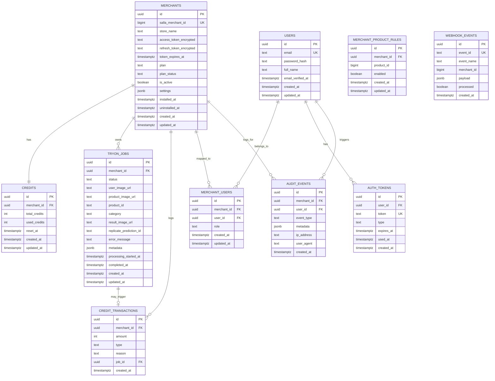

# ERD - Virtual Try-On

**Database:** Supabase PostgreSQL  
**Access Pattern:** direct Supabase JS client from the backend  
**Security Model:** backend-enforced tenancy with RLS enabled

---

## Entity Overview

The MVP data model is intentionally small and centered on the merchant tenant.

### Core entities

- `merchants`
- `credits`
- `credit_transactions`
- `tryon_jobs`
- `webhook_events`

### Key rule

Every business record is rooted in the merchant tenant:

- `merchant_id`
- `salla_merchant_id`

Email and `user_id` are not tenant roots.

---

## Mermaid ERD



---

## Table Specifications

### 1. `merchants`

Source of truth for every installed Salla store.

| Column | Type | Constraints | Description |
|---|---|---|---|
| `id` | `uuid` | PK | Internal merchant UUID |
| `salla_merchant_id` | `bigint` | UNIQUE, NOT NULL | Store identifier from Salla OAuth and webhooks |
| `store_name` | `text` | nullable | Merchant store name |
| `access_token_encrypted` | `text` | nullable | Encrypted Salla access token |
| `refresh_token_encrypted` | `text` | nullable | Encrypted Salla refresh token |
| `token_expires_at` | `timestamptz` | nullable | Token expiry timestamp |
| `plan` | `text` | NOT NULL | free, trial, basic, professional, enterprise |
| `plan_status` | `text` | NOT NULL | active or inactive |
| `is_active` | `boolean` | NOT NULL | Whether the app is currently active for the store |
| `settings` | `jsonb` | NOT NULL | Normalized widget settings |
| `installed_at` | `timestamptz` | nullable | Install timestamp |
| `uninstalled_at` | `timestamptz` | nullable | Soft-delete uninstall timestamp |
| `created_at` | `timestamptz` | NOT NULL | Row creation time |
| `updated_at` | `timestamptz` | NOT NULL | Row update time |

### Canonical `settings` shape (Unified V2)

```json
{
  "schema_version": 2,
  "widget_enabled": true,
  "button": {
    "preset": "core-solid",
    "label": "جرّب الآن",
    "icon": {
      "enabled": true,
      "name": "sparkles",
      "position": "start"
    },
    "size": "md",
    "placement_mode": "inline",
    "mobile_mode": "sticky",
    "full_width": false
  },
  "window": {
    "preset": "classic-center-modal",
    "motion_profile": "soft-scale",
    "backdrop": "blur-dark",
    "close_style": "icon-top-inline",
    "result_layout": "before-after-prominent"
  },
  "visual_identity": {
    "brand_color": "#7c3aed",
    "surface_style": "glass",
    "corner_radius": "balanced",
    "spacing_density": "comfortable",
    "typography_tone": "modern"
  },
  "display_rules": {
    "eligibility_mode": "all",
    "selected_product_ids": [],
    "selected_category_ids": [],
    "placement_target": "above-product-options",
    "display_timing": "immediate"
  },
  "runtime_safeguards": {
    "zero_credit_behavior": "disabled-with-message",
    "require_product_image": true
  }
}
```

---

### 2. `credits`

Exactly one row per merchant for balance tracking.

| Column | Type | Constraints | Description |
|---|---|---|---|
| `id` | `uuid` | PK | Internal row id |
| `merchant_id` | `uuid` | FK, UNIQUE | Owning merchant |
| `total_credits` | `int` | NOT NULL | Allocated credits for the cycle |
| `used_credits` | `int` | NOT NULL | Credits consumed so far |
| `reset_at` | `timestamptz` | nullable | Last renewal/reset timestamp |
| `created_at` | `timestamptz` | NOT NULL | Row creation time |
| `updated_at` | `timestamptz` | NOT NULL | Row update time |

### Derived balance

`remaining_credits = total_credits - used_credits`

---

### 3. `tryon_jobs`

Tracks every shopper or merchant-originated try-on attempt.

| Column | Type | Constraints | Description |
|---|---|---|---|
| `id` | `uuid` | PK | Job id returned to the client |
| `merchant_id` | `uuid` | FK, NOT NULL | Owning merchant |
| `status` | `text` | NOT NULL | pending, processing, completed, failed, canceled |
| `user_image_url` | `text` | NOT NULL | Shopper image on Bunny |
| `product_image_url` | `text` | NOT NULL | Product image used for the try-on |
| `product_id` | `text` | nullable | Salla product id |
| `category` | `text` | NOT NULL | upper_body, lower_body, dresses |
| `result_image_url` | `text` | nullable | Final Bunny result |
| `replicate_prediction_id` | `text` | nullable | Replicate prediction id |
| `error_message` | `text` | nullable | Failure reason |
| `metadata` | `jsonb` | NOT NULL | Source, thumbnails, upload paths, debug-safe context |
| `processing_started_at` | `timestamptz` | nullable | Processing start timestamp |
| `completed_at` | `timestamptz` | nullable | Completion or failure timestamp |
| `created_at` | `timestamptz` | NOT NULL | Creation time |
| `updated_at` | `timestamptz` | NOT NULL | Update time |

### Status flow

`pending -> processing -> completed | failed | canceled`

---

### 4. `webhook_events`

Idempotency ledger for Salla webhooks.

| Column | Type | Constraints | Description |
|---|---|---|---|
| `id` | `uuid` | PK | Internal row id |
| `event_id` | `text` | UNIQUE, NOT NULL | Stable idempotency key |
| `event_name` | `text` | NOT NULL | Webhook event name |
| `merchant_id` | `bigint` | nullable | Salla merchant id from payload |
| `payload` | `jsonb` | nullable | Full webhook payload |
| `processed` | `boolean` | NOT NULL | Whether the handler completed |
| `created_at` | `timestamptz` | NOT NULL | Receipt timestamp |

---

### 5. `credit_transactions`

Audit trail for every credit movement.

| Column | Type | Constraints | Description |
|---|---|---|---|
| `id` | `uuid` | PK | Internal row id |
| `merchant_id` | `uuid` | FK, NOT NULL | Owning merchant |
| `amount` | `int` | NOT NULL | Positive or negative credit movement |
| `type` | `text` | NOT NULL | debit, refund, reset, topup, credit |
| `reason` | `text` | nullable | Human-readable reason |
| `job_id` | `uuid` | FK, nullable | Related try-on job if present |
| `created_at` | `timestamptz` | NOT NULL | Transaction time |

---

### 6. `merchant_product_rules`

Granular, product-specific widget visibility rules.

| Column | Type | Constraints | Description |
|---|---|---|---|
| `id` | `uuid` | PK | Internal rule id |
| `merchant_id` | `uuid` | FK, NOT NULL | Owning merchant |
| `product_id` | `bigint` | NOT NULL | Target sibling product (Salla ID) |
| `enabled` | `boolean` | DEFAULT true | Whether the widget should show for this product |
| `created_at` | `timestamptz` | NOT NULL | Creation time |
| `updated_at` | `timestamptz` | NOT NULL | Update time |

---

### 7. `merchant_users`

Mapping between local users and merchant tenants.

| Column | Type | Constraints | Description |
|---|---|---|---|
| `id` | `uuid` | PK | Internal mapping id |
| `merchant_id` | `uuid` | FK, NOT NULL | Target merchant |
| `user_id` | `uuid` | FK, NOT NULL | Target user |
| `role` | `text` | NOT NULL | owner, admin |
| `created_at` | `timestamptz` | NOT NULL | Creation time |
| `updated_at` | `timestamptz` | NOT NULL | Update time |

---

### 8. `auth_tokens`

Security tokens for password resets and set-password flows.

| Column | Type | Constraints | Description |
|---|---|---|---|
| `id` | `uuid` | PK | Token id |
| `user_id` | `uuid` | FK, NOT NULL | Owning user |
| `token` | `text` | UNIQUE, NOT NULL | Secure token string |
| `type` | `text` | NOT NULL | set-password, reset-password |
| `expires_at` | `timestamptz` | NOT NULL | Expiry time |
| `used_at` | `timestamptz` | nullable | When the token was consumed |
| `created_at` | `timestamptz` | NOT NULL | Creation time |

---

### 9. `audit_events`

Global security and system audit log.

| Column | Type | Constraints | Description |
|---|---|---|---|
| `id` | `uuid` | PK | Event id |
| `merchant_id` | `uuid` | FK, nullable | Related merchant |
| `user_id` | `uuid` | FK, nullable | Related user |
| `event_type` | `text` | NOT NULL | login, logout, password_change, etc. |
| `metadata` | `jsonb` | NOT NULL | Contextual event data |
| `ip_address` | `text` | nullable | Actor IP |
| `user_agent` | `text` | nullable | Actor Device |
| `created_at` | `timestamptz` | NOT NULL | Log time |

---

## Required Indexes

| Index | Purpose |
|---|---|
| `idx_merchants_salla` | lookup merchant by Salla id |
| `idx_jobs_status` | worker polling on pending and processing jobs |
| `idx_jobs_merchant` | per-merchant jobs listing |
| `idx_webhook_event_id` | webhook idempotency |
| `idx_credit_tx_merchant` | merchant credit audit trail |

---

## Required Database Functions

### `deduct_credit(merchant_id, job_id)`

- locks the merchant credit row
- verifies balance
- deducts 1 credit atomically
- logs a debit transaction

### `refund_credit(merchant_id, job_id)`

- restores 1 credit when the AI job fails
- logs a refund transaction

### `update_updated_at()`

- keeps `updated_at` current on update for mutable tables

---

## Storage Layout

```txt
/{salla_merchant_id}/
├── uploads/
│   └── {uuid}.jpg
├── results/
│   └── {uuid}.jpg
└── products/
    └── {product_id}.jpg
```

---

## Data Flow Summary

```txt
Salla Webhook -> webhook_events -> merchants/credits/settings
External OAuth Callback -> merchants -> encrypted tokens -> dashboard session
Dashboard API Calls -> products/credits/jobs/widget settings
Widget Job -> credits deduct -> tryon_jobs pending -> Replicate -> Bunny -> widget polls result
```

---

## Notes

- The ERD is deliberately merchant-centric.
- Shopper identity is not a first-class tenant concept in MVP.
- Widget eligibility stays merchant-owned through normalized merchant settings.
